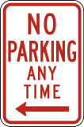
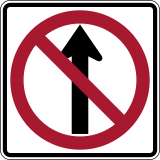
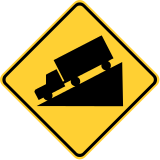
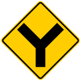

<h1>PNG_USA_RoadSigns_160classes V.2 (Updated:2022/05/23)</h1>
This is a dataset of 160classes of PNG USA RoadSigns.
 
The dataset has been taken from the following website: 
<a href="https://en.wikipedia.org/wiki/Road_signs_in_the_United_States">Road signs in the United States</a>
 
1.Removed missplaced jpg files, and added the following two files to become 160 classes in total:   
No_parking_any_time.png 
No_thru_movement.png 
2.Updated the order of classes in classe.txt file.
 
<a href="./PNG_USA_RoadSigns_160classes_Small">PNG_USA_RoadSigns_160classes_Small</a> 
<a href="./PNG_USA_RoadSigns_160classes_Medium">PNG_USA_RoadSigns_160classes_Medium</a> 
 

160classes: 
<table>
<tr>
<td wrap>
1: 270_degree_loop
 

</td>
<td wrap>
2: Added_lane_from_entering_roadway
 

</td>
<td wrap>
3: Added_lane
 

</td>
</tr>
<tr>
<td wrap>
4: All_way
 

</td>
<td wrap>
5: Be_prepared_to_stop
 

</td>
<td wrap>
6: Bicycle_wrong_way
 

</td>
</tr>
<tr>
<td wrap>
7: Bicycles_and_pedestrians
 

</td>
<td wrap>
8: Bicycles_left_pedestrians_right
 

</td>
<td wrap>
9: Bicycles
 

</td>
</tr>
<tr>
<td wrap>
10: Bike_lane_slippery_when_wet
 

</td>
<td wrap>
11: Bike_lane
 

</td>
<td wrap>
12: Bump
 

</td>
</tr>
<tr>
<td wrap>
13: Bus_lane
 

</td>
<td wrap>
14: Center_lane
 

</td>
<td wrap>
15: Chevron_alignment
 

</td>
</tr>
<tr>
<td wrap>
16: Circular_intersection_warning
 

</td>
<td wrap>
17: Cross_roads
 

</td>
<td wrap>
18: Curve
 

</td>
</tr>
<tr>
<td wrap>
19: Dead_end
 

</td>
<td wrap>
20: Deer_crossing
 

</td>
<td wrap>
21: Detour_right
 

</td>
</tr>
<tr>
<td wrap>
22: Detour
 

</td>
<td wrap>
23: Dip
 

</td>
<td wrap>
24: Do_not_drive_on_tracks
 

</td>
</tr>
<tr>
<td wrap>
25: Do_not_enter
 

</td>
<td wrap>
26: Do_not_pass_stopped_trains
 

</td>
<td wrap>
27: Double_side_roads
 

</td>
</tr>
<tr>
<td wrap>
28: Emergency_signal
 

</td>
<td wrap>
29: End_detour
 

</td>
<td wrap>
30: Except_right_turn
 

</td>
</tr>
<tr>
<td wrap>
31: Fallen_rocks
 

</td>
<td wrap>
32: Flagger_present
 

</td>
<td wrap>
33: Fog_area
 

</td>
</tr>
<tr>
<td wrap>
34: Go_on_slow
 

</td>
<td wrap>
35: Golf_cart_crossing
 

</td>
<td wrap>
36: Gusty_winds_area
 

</td>
</tr>
<tr>
<td wrap>
37: Hairpin_curve
 

</td>
<td wrap>
38: Hazardous_material_prohibited
 

</td>
<td wrap>
39: Hazardous_material_route
 

</td>
</tr>
<tr>
<td wrap>
40: Hidden_driveway
 

</td>
<td wrap>
41: Hill_bicycle
 

</td>
<td wrap>
42: Horizontal_alignment_intersection
 

</td>
</tr>
<tr>
<td wrap>
43: Horse_drawn_vehicle_ahead
 

</td>
<td wrap>
44: Keep_left_2
 

</td>
<td wrap>
45: Keep_left
 

</td>
</tr>
<tr>
<td wrap>
46: Keep_right_2
 

</td>
<td wrap>
47: Keep_right
 

</td>
<td wrap>
48: Lane_ends
 

</td>
</tr>
<tr>
<td wrap>
49: Left_lane
 

</td>
<td wrap>
50: Left_turn_only
 

</td>
<td wrap>
51: Left_turn_or_straight
 

</td>
</tr>
<tr>
<td wrap>
52: Left_turn_yield_on_green
 

</td>
<td wrap>
53: Loading_zone
 

</td>
<td wrap>
54: Low_clearance
 

</td>
</tr>
<tr>
<td wrap>
55: Low_ground_clearance_railroad_crossing
 

</td>
<td wrap>
56: Merge
 

</td>
<td wrap>
57: Merging_traffic
 

</td>
</tr>
<tr>
<td wrap>
58: Metric_low_clearance
 

</td>
<td wrap>
59: Minimum_speed_limit_40
 

</td>
<td wrap>
60: Minimum_speed_limit_60km
 

</td>
</tr>
<tr>
<td wrap>
61: Narrow_bridge
 

</td>
<td wrap>
62: National_network_prohibited
 

</td>
<td wrap>
63: National_network_route
 

</td>
</tr>
<tr>
<td wrap>
64: Night_speed_limit_45
 

</td>
<td wrap>
65: Night_speed_limit_70km
 

</td>
<td wrap>
66: No_bicycles
 

</td>
</tr>
<tr>
<td wrap>
67: No_entre
 

</td>
<td wrap>
68: No_hitch_hiking
 

</td>
<td wrap>
69: No_horseback_riding
 

</td>
</tr>
<tr>
<td wrap>
70: No_large_trucks
 

</td>
<td wrap>
71: No_left_or_u_turn
 

</td>
<td wrap>
72: No_left_turn_across_tracks
 

</td>
</tr>
<tr>
<td wrap>
73: No_left_turn
 

</td>
<td wrap>
74: No_outlet
 

</td>
<td wrap>
75: No_parking_any_time
 

</td>
</tr>
<tr>
<td wrap>
76: No_parking_bus_stop
 

</td>
<td wrap>
77: No_parking_from_830am_to_530pm_2
 

</td>
<td wrap>
78: No_parking_from_830am_to_530pm
 

</td>
</tr>
<tr>
<td wrap>
79: No_parking_in_fire_lane
 

</td>
<td wrap>
80: No_parking_loading_zone
 

</td>
<td wrap>
81: No_parking_on_pavement
 

</td>
</tr>
<tr>
<td wrap>
82: No_parking
 

</td>
<td wrap>
83: No_pedestrian_crossing
 

</td>
<td wrap>
84: No_pedestrians
 

</td>
</tr>
<tr>
<td wrap>
85: No_right_turn
 

</td>
<td wrap>
86: No_rollerblading
 

</td>
<td wrap>
87: No_standing_any_time
 

</td>
</tr>
<tr>
<td wrap>
88: No_stopping_on_pavement
 

</td>
<td wrap>
89: No_straight_through
 

</td>
<td wrap>
90: No_thru_movement
 

</td>
</tr>
<tr>
<td wrap>
91: No_train_horn_warning
 

</td>
<td wrap>
92: No_turns
 

</td>
<td wrap>
93: No_u_turn
 

</td>
</tr>
<tr>
<td wrap>
94: No_unauthorized_vehicles
 

</td>
<td wrap>
95: Offset_roads
 

</td>
<td wrap>
96: One_direction
 

</td>
</tr>
<tr>
<td wrap>
97: One_way
 

</td>
<td wrap>
98: Parking_with_time_restrictions
 

</td>
<td wrap>
99: Pass_on_either_side
 

</td>
</tr>
<tr>
<td wrap>
100: Pass_road
 

</td>
<td wrap>
101: Path_narrows
 

</td>
<td wrap>
102: Pedestrian_crossing
 

</td>
</tr>
<tr>
<td wrap>
103: Railroad_crossing_ahead
 

</td>
<td wrap>
104: Railroad_crossing
 

</td>
<td wrap>
105: Railroad_intersection_warning
 

</td>
</tr>
<tr>
<td wrap>
106: Ramp_narrows
 

</td>
<td wrap>
107: Reserved_parking_wheelchair
 

</td>
<td wrap>
108: Reverse_curve
 

</td>
</tr>
<tr>
<td wrap>
109: Reverse_turn
 

</td>
<td wrap>
110: Right_lane
 

</td>
<td wrap>
111: Right_turn_only
 

</td>
</tr>
<tr>
<td wrap>
112: Right_turn_or_straight
 

</td>
<td wrap>
113: Road_closed_ahead
 

</td>
<td wrap>
114: Road_closed
 

</td>
</tr>
<tr>
<td wrap>
115: Road_narrows
 

</td>
<td wrap>
116: Road_slippery_when_wet
 

</td>
<td wrap>
117: Rough_road
 

</td>
</tr>
<tr>
<td wrap>
118: Runaway_vehicles_only
 

</td>
<td wrap>
119: School_advance
 

</td>
<td wrap>
120: School_bus_stop_ahead
 

</td>
</tr>
<tr>
<td wrap>
121: School_bus_turn_ahead
 

</td>
<td wrap>
122: School_speed_limit_ahead
 

</td>
<td wrap>
123: School
 

</td>
</tr>
<tr>
<td wrap>
124: Sharp_turn
 

</td>
<td wrap>
125: Side_road_at_a_perpendicular_angle
 

</td>
<td wrap>
126: Side_road_at_an_acute_angle
 

</td>
</tr>
<tr>
<td wrap>
127: Single_lane_shift_left
 

</td>
<td wrap>
128: Skewed_railroad_crossing
 

</td>
<td wrap>
129: Snowmobile
 

</td>
</tr>
<tr>
<td wrap>
130: Speed_limit_50
 

</td>
<td wrap>
131: Speed_limit_80km
 

</td>
<td wrap>
132: Stay_in_lane
 

</td>
</tr>
<tr>
<td wrap>
133: Steep_grade_percentage
 

</td>
<td wrap>
134: Steep_grade
 

</td>
<td wrap>
135: Stop_here_for_pedestrians
 

</td>
</tr>
<tr>
<td wrap>
136: Stop_here_for_peds
 

</td>
<td wrap>
137: Stop
 

</td>
<td wrap>
138: Straight_ahead_only
 

</td>
</tr>
<tr>
<td wrap>
139: T_roads
 

</td>
<td wrap>
140: Tractor_farm_vehicle_crossing_2
 

</td>
<td wrap>
141: Tractor_farm_vehicle_crossing
 

</td>
</tr>
<tr>
<td wrap>
142: Truck crossing_2
 

</td>
<td wrap>
143: Truck_crossing
 

</td>
<td wrap>
144: Truck_rollover_warning
 

</td>
</tr>
<tr>
<td wrap>
145: Truck_route_sign
 

</td>
<td wrap>
146: Truck_speed_limit_40
 

</td>
<td wrap>
147: Turn_only_lanes
 

</td>
</tr>
<tr>
<td wrap>
148: Turning_vehicles_yield_to_pedestrians
 

</td>
<td wrap>
149: Two_direction
 

</td>
<td wrap>
150: Two_way_traffic
 

</td>
</tr>
<tr>
<td wrap>
151: Wait_on_stop
 

</td>
<td wrap>
152: Weight_limit_10t
 

</td>
<td wrap>
153: Winding_road
 

</td>
</tr>
<tr>
<td wrap>
154: Work_zone_for_speed_limit
 

</td>
<td wrap>
155: Workers_on_road
 

</td>
<td wrap>
156: Wrong_way
 

</td>
</tr>
<tr>
<td wrap>
157: Y_roads
 

</td>
<td wrap>
158: Yield_here_to_pedestrians
 

</td>
<td wrap>
159: Yield_here_to_peds
 

</td>
</tr>
<tr>
<td wrap>
160: Yield
 

</td>
</tr>
</table>

