<h1>PNG_USA_RoadSigns_160classes</h1>

This is a dataset of 160classes of PNG USA RoadSigns.
 
The dataset has been taken from the following website: 
<a href="https://en.wikipedia.org/wiki/Road_signs_in_the_United_States">Road signs in the United States</a>
 

 
<a href="./PNG_USA_RoadSigns_160classes_Small">PNG_USA_RoadSigns_160classes_Small</a> 
<a href="./PNG_USA_RoadSigns_160classes_Medium">PNG_USA_RoadSigns_160classes_Medium</a> 
 

160classes: 
<table>
<tr>
<td>
270_degree_loop
 
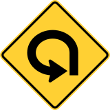
</td>
<td>
Added_lane
 
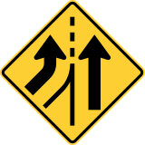
</td>
<td>
Added_lane_from_entering_roadway
 
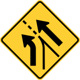
</td>
</tr>
<tr>
<td>
All_way
 

</td>
<td>
Be_prepared_to_stop
 
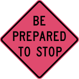
</td>
<td>
Bicycles
 
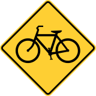
</td>
</tr>
<tr>
<td>
Bicycles_and_pedestrians
 
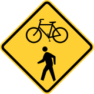
</td>
<td>
Bicycles_left_pedestrians_right
 
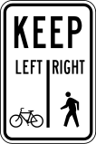
</td>
<td>
Bicycle_wrong_way
 
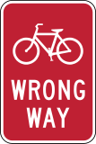
</td>
</tr>
<tr>
<td>
Bike_lane
 
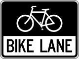
</td>
<td>
Bike_lane_slippery_when_wet
 
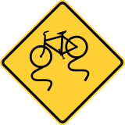
</td>
<td>
Bump
 
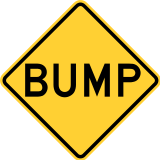
</td>
</tr>
<tr>
<td>
Bus_lane
 
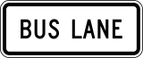
</td>
<td>
Center_lane
 
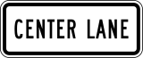
</td>
<td>
Chevron_alignment
 

</td>
</tr>
<tr>
<td>
Circular_intersection_warning
 
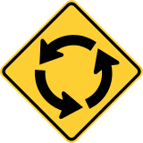
</td>
<td>
Cross_roads
 
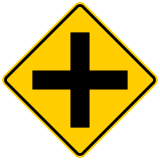
</td>
<td>
Curve
 
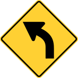
</td>
</tr>
<tr>
<td>
Dead_end
 
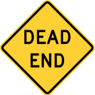
</td>
<td>
Deer_crossing
 
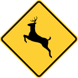
</td>
<td>
Detour
 
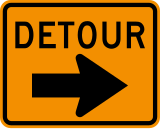
</td>
</tr>
<tr>
<td>
Detour_right
 
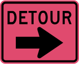
</td>
<td>
Dip
 
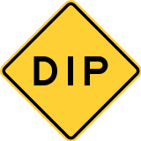
</td>
<td>
Double_side_roads
 
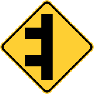
</td>
</tr>
<tr>
<td>
Do_not_drive_on_tracks
 
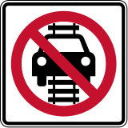
</td>
<td>
Do_not_enter
 
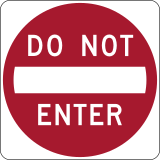
</td>
<td>
Do_not_pass_stopped_trains
 
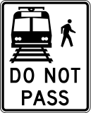
</td>
</tr>
<tr>
<td>
Emergency_signal
 
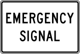
</td>
<td>
End_detour
 
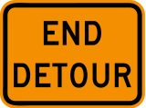
</td>
<td>
Except_right_turn
 
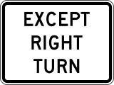
</td>
</tr>
<tr>
<td>
Fallen_rocks
 
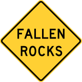
</td>
<td>
Flagger_present
 
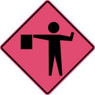
</td>
<td>
Fog_area
 
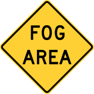
</td>
</tr>
<tr>
<td>
Golf_cart_crossing
 
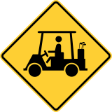
</td>
<td>
Go_on_slow
 
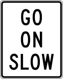
</td>
<td>
Gusty_winds_area
 
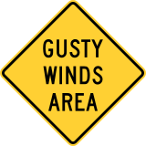
</td>
</tr>
<tr>
<td>
Hairpin_curve
 
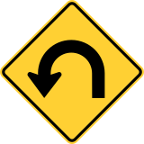
</td>
<td>
Hazardous_material_prohibited
 
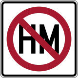
</td>
<td>
Hazardous_material_route
 
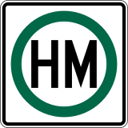
</td>
</tr>
<tr>
<td>
Hidden_driveway
 
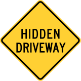
</td>
<td>
Hill_bicycle
 
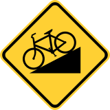
</td>
<td>
Horizontal_alignment_intersection
 
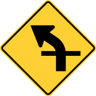
</td>
</tr>
<tr>
<td>
Horse_drawn_vehicle_ahead
 
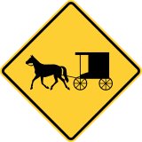
</td>
<td>
Keep_left
 
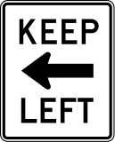
</td>
<td>
Keep_left_2
 
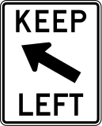
</td>
</tr>
<tr>
<td>
Keep_right
 
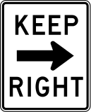
</td>
<td>
Keep_right_2
 
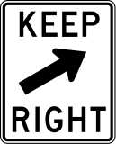
</td>
<td>
Lane_ends
 
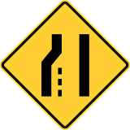
</td>
</tr>
<tr>
<td>
Left_lane
 
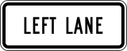
</td>
<td>
Left_turn_only
 
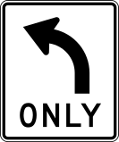
</td>
<td>
Left_turn_or_straight
 
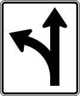
</td>
</tr>
<tr>
<td>
Left_turn_yield_on_green
 
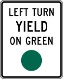
</td>
<td>
Loading_zone
 

</td>
<td>
Low_clearance
 

</td>
</tr>
<tr>
<td>
Low_ground_clearance_railroad_crossing
 

</td>
<td>
Merge
 

</td>
<td>
Merging_traffic
 

</td>
</tr>
<tr>
<td>
Metric_low_clearance
 

</td>
<td>
Minimum_speed_limit_40
 

</td>
<td>
Minimum_speed_limit_60km
 

</td>
</tr>
<tr>
<td>
Narrow_bridge.jpg
 

</td>
<td>
Narrow_bridge
 

</td>
<td>
National_network_prohibited
 

</td>
</tr>
<tr>
<td>
National_network_route
 

</td>
<td>
Night_speed_limit_45
 

</td>
<td>
Night_speed_limit_70km
 

</td>
</tr>
<tr>
<td>
No_bicycles
 

</td>
<td>
No_entre
 

</td>
<td>
No_hitch_hiking
 

</td>
</tr>
<tr>
<td>
No_horseback_riding
 

</td>
<td>
No_large_trucks
 

</td>
<td>
No_left_or_u_turn
 

</td>
</tr>
<tr>
<td>
No_left_turn
 

</td>
<td>
No_left_turn_across_tracks
 

</td>
<td>
No_outlet
 

</td>
</tr>
<tr>
<td>
No_parking
 

</td>
<td>
No_parking_bus_stop
 

</td>
<td>
No_parking_from_830am_to_530pm
 

</td>
</tr>
<tr>
<td>
No_parking_from_830am_to_530pm_2
 

</td>
<td>
No_parking_in_fire_lane
 

</td>
<td>
No_parking_loading_zone
 

</td>
</tr>
<tr>
<td>
No_parking_on_pavement
 

</td>
<td>
No_pedestrians
 

</td>
<td>
No_pedestrian_crossing
 

</td>
</tr>
<tr>
<td>
No_right_turn
 

</td>
<td>
No_rollerblading
 

</td>
<td>
No_standing_any_time
 

</td>
</tr>
<tr>
<td>
No_stopping_on_pavement
 

</td>
<td>
No_straight_through
 

</td>
<td>
No_train_horn_warning
 

</td>
</tr>
<tr>
<td>
No_turns
 

</td>
<td>
No_unauthorized_vehicles
 

</td>
<td>
No_u_turn
 

</td>
</tr>
<tr>
<td>
Offset_roads
 

</td>
<td>
One_direction
 

</td>
<td>
One_way
 

</td>
</tr>
<tr>
<td>
Parking_with_time_restrictions
 

</td>
<td>
Pass_on_either_side
 

</td>
<td>
Pass_road
 

</td>
</tr>
<tr>
<td>
Path_narrows.jpg
 

</td>
<td>
Path_narrows
 

</td>
<td>
Pedestrian_crossing
 

</td>
</tr>
<tr>
<td>
Railroad_crossing
 

</td>
<td>
Railroad_crossing_ahead
 

</td>
<td>
Railroad_intersection_warning
 

</td>
</tr>
<tr>
<td>
Ramp_narrows
 

</td>
<td>
Reserved_parking_wheelchair
 

</td>
<td>
Reverse_curve
 

</td>
</tr>
<tr>
<td>
Reverse_turn
 

</td>
<td>
Right_lane
 

</td>
<td>
Right_turn_only
 

</td>
</tr>
<tr>
<td>
Right_turn_or_straight
 

</td>
<td>
Road_closed
 

</td>
<td>
Road_closed_ahead
 

</td>
</tr>
<tr>
<td>
Road_narrows
 

</td>
<td>
Road_slippery_when_wet
 

</td>
<td>
Rough_road
 

</td>
</tr>
<tr>
<td>
Runaway_vehicles_only
 

</td>
<td>
School
 

</td>
<td>
School_advance
 

</td>
</tr>
<tr>
<td>
School_bus_stop_ahead
 

</td>
<td>
School_bus_turn_ahead
 

</td>
<td>
School_speed_limit_ahead
 

</td>
</tr>
<tr>
<td>
Sharp_turn
 

</td>
<td>
Side_road_at_an_acute_angle
 

</td>
<td>
Side_road_at_a_perpendicular_angle
 

</td>
</tr>
<tr>
<td>
Single_lane_shift_left
 

</td>
<td>
Skewed_railroad_crossing
 

</td>
<td>
Snowmobile
 

</td>
</tr>
<tr>
<td>
Speed_limit_50
 

</td>
<td>
Speed_limit_80km
 

</td>
<td>
Stay_in_lane
 

</td>
</tr>
<tr>
<td>
Steep grade
 

</td>
<td>
Steep_grade_percentage
 

</td>
<td>
Stop
 

</td>
</tr>
<tr>
<td>
Stop_here_for_pedestrians
 

</td>
<td>
Stop_here_for_peds
 

</td>
<td>
Straight_ahead_only
 

</td>
</tr>
<tr>
<td>
Tractor_farm_vehicle_crossing
 

</td>
<td>
Tractor_farm_vehicle_crossing_2
 

</td>
<td>
Truck crossing_2
 

</td>
</tr>
<tr>
<td>
Truck_crossing
 

</td>
<td>
Truck_rollover_warning
 

</td>
<td>
Truck_route_sign
 

</td>
</tr>
<tr>
<td>
Truck_speed_limit_40
 

</td>
<td>
Turning_vehicles_yield_to_pedestrians
 

</td>
<td>
Turn_only_lanes
 

</td>
</tr>
<tr>
<td>
Two_direction
 

</td>
<td>
Two_way_traffic
 

</td>
<td>
T_roads
 

</td>
</tr>

<tr>
<td>
Wait_on_stop
 

</td>
<td>
Weight_limit_10t
 

</td>
<td>
Winding_road
 

</td>
</tr>
<tr>
<td>
Workers_on_road
 

</td>
<td>
Work_zone_for_speed_limit
 

</td>
<td>
Wrong_way
 

</td>
</tr>
<tr>
<td>
Yield
 

</td>
<td>
Yield_here_to_pedestrians
 

</td>
<td>
Yield_here_to_peds
 

</td>
</tr>
</table>

